# User Flow Diagrams

## Authentication Flows

### Registration Flow

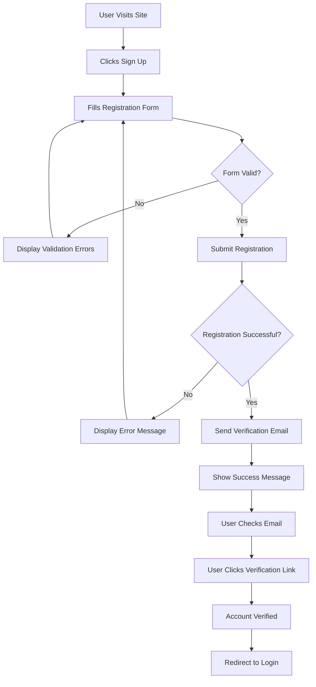

### Login Flow

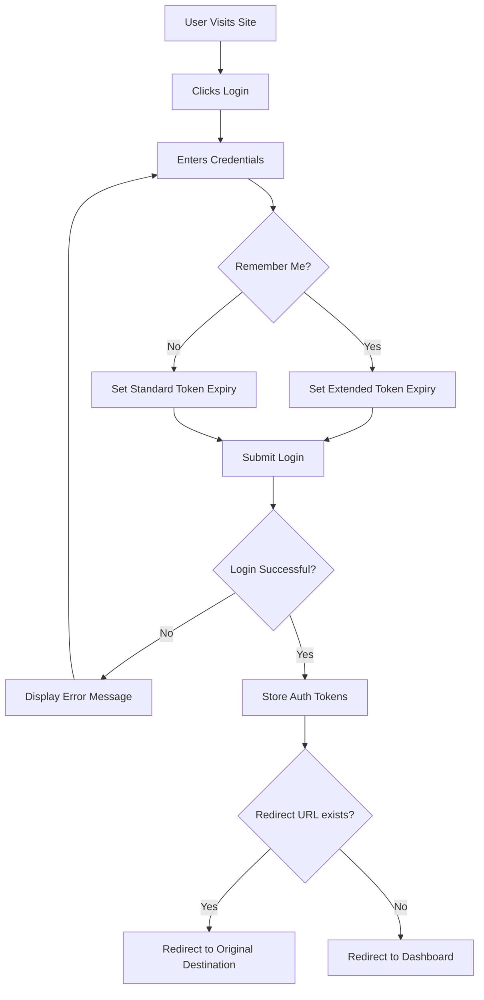

### Password Reset Flow

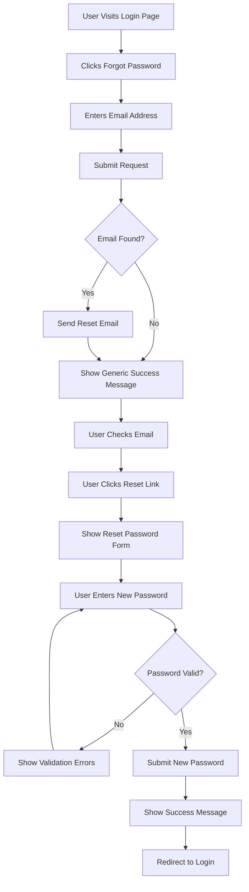

## Core Application Flows

### Dashboard Navigation Flow

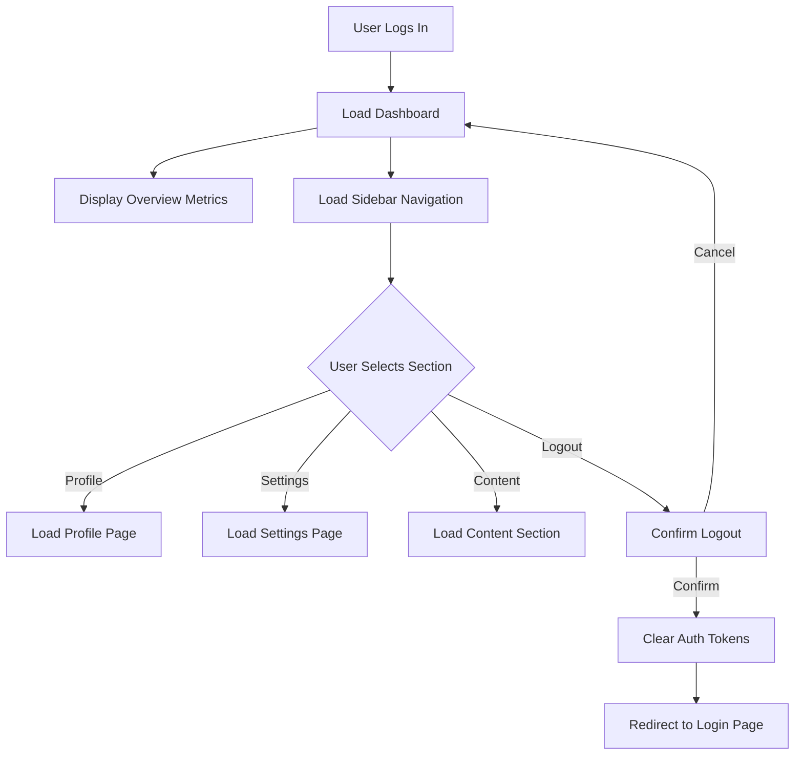

### Profile Update Flow

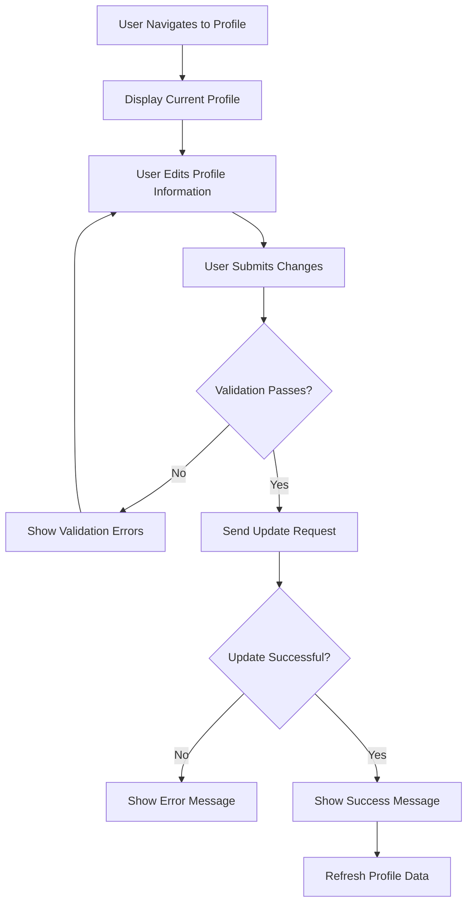

### Content Creation Flow

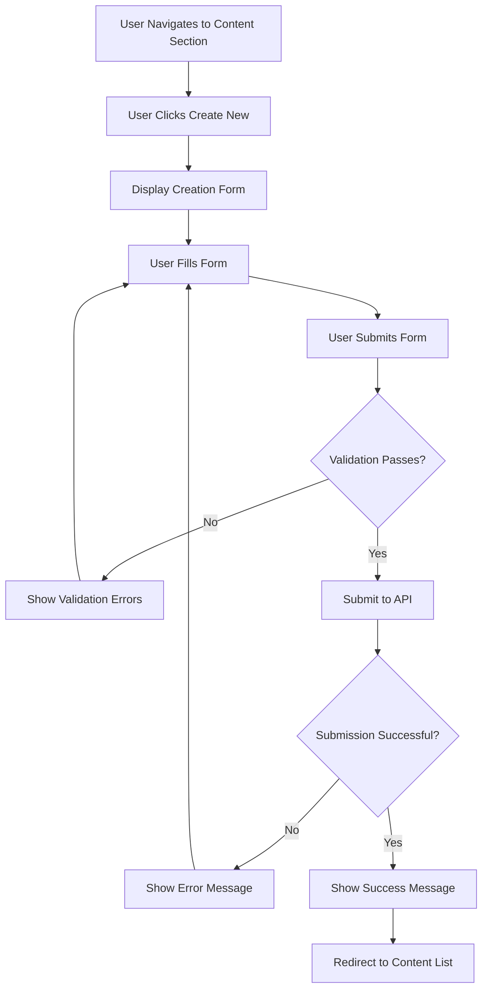

## Error Handling Flows

### Network Error Flow

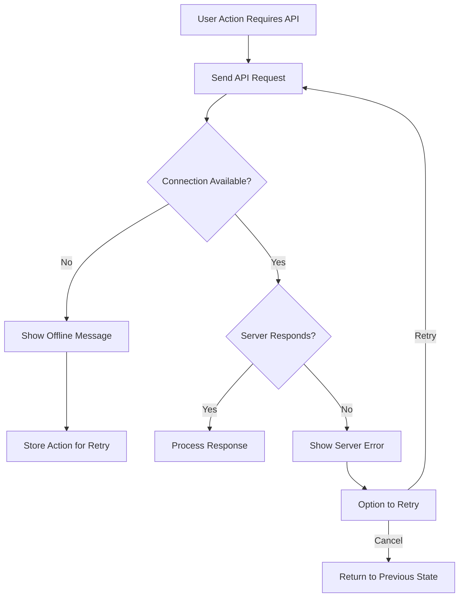

### Authentication Error Flow

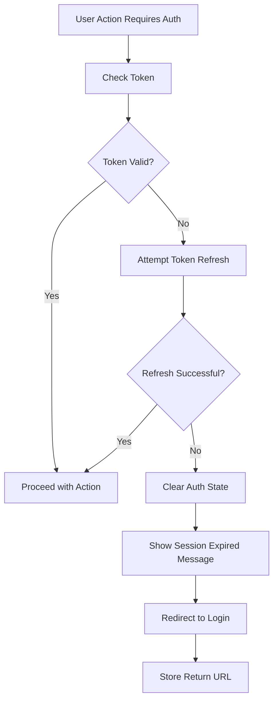

### Form Submission Error Flow

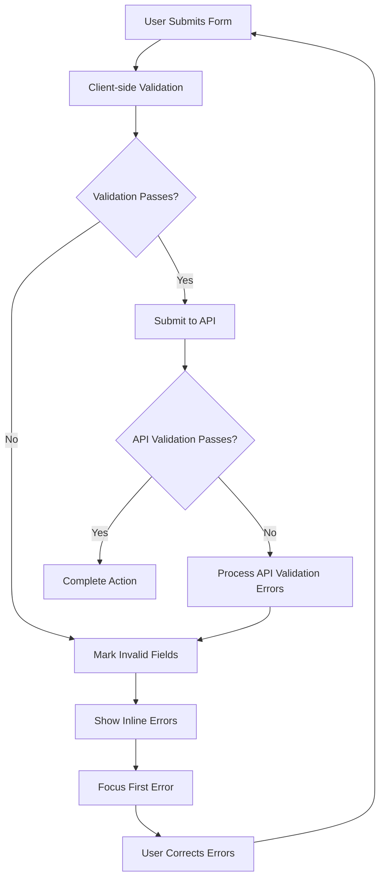

## Mobile-Specific Flows

### Mobile Navigation Flow

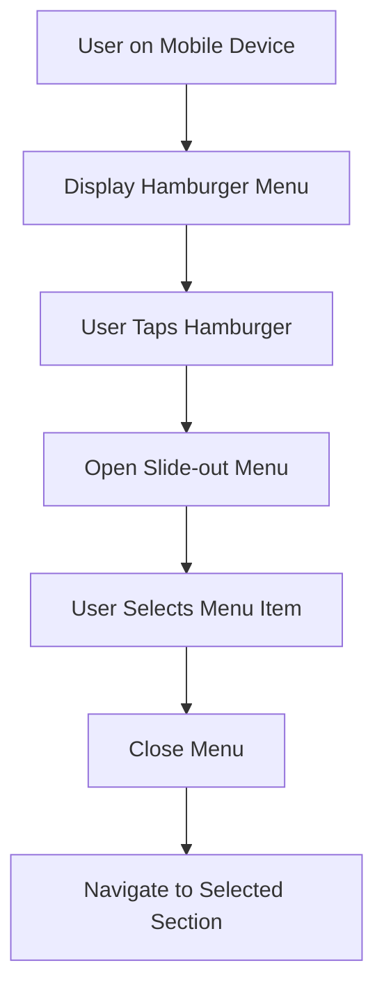

### Mobile Form Interaction Flow

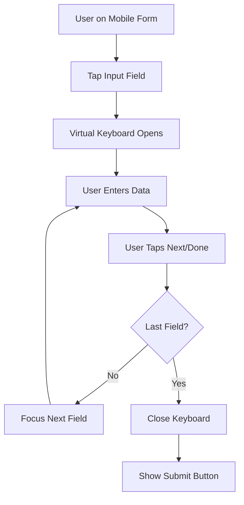

## Implementation Notes

1. These flow diagrams should be referenced when implementing each feature.
2. Error handling should follow the patterns outlined in the error flows.
3. Mobile interactions require special attention to keyboard behavior and touch targets.
4. Authentication state should be checked before rendering protected routes.
5. Form validation should happen both client-side and server-side.
